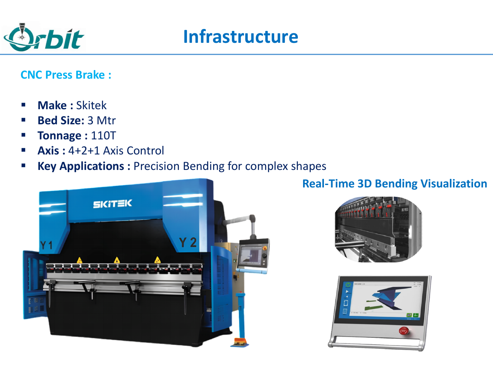
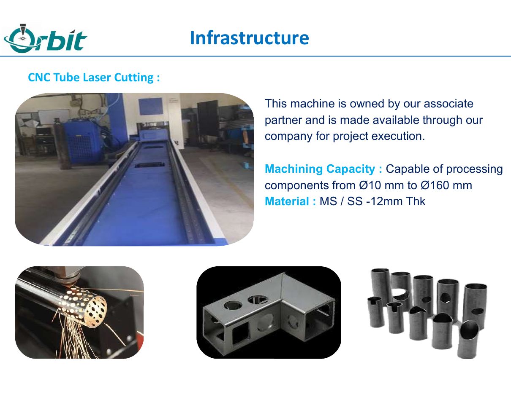
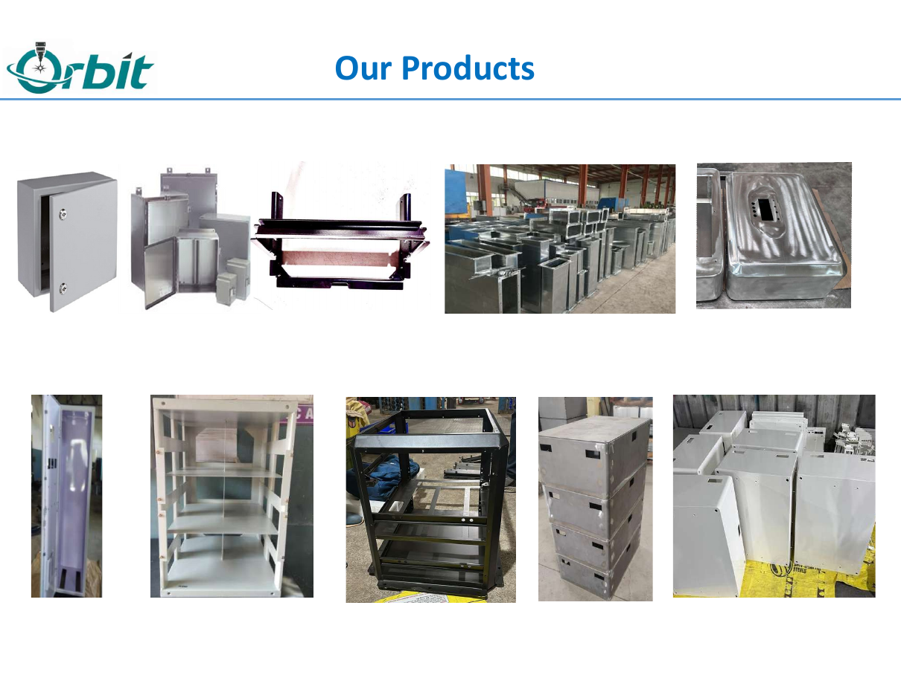

> **Reporting note:** This first profile is based on Orbit Laser Cutting's company profile and ISO certificate supplied to Porul.in. It has been written as an editorial introduction rather than a supplier listing.

There is a particular kind of manufacturing confidence that does not need a long sales pitch. It is visible in the sequence of the work: material comes in, the cut is clean, the bend holds its geometry, fabrication follows, the part is packed and dispatched. Each step is ordinary on its own. Getting all of them to work together, repeatedly and on time, is the hard part.

Orbit Laser Cutting operates from the SIPCOT-1 Industrial Estate in Hosur, one of Tamil Nadu's most concentrated manufacturing corridors. The company describes itself as a precision engineering and sheet-metal fabrication firm working across B2B and B2C engineering solutions. Its stated ambition is refreshingly direct: _making a mark_ through trust and quality.

That is a useful way to read the operation. Orbit's work is not built around one dramatic capability. It is built around the hand-offs that make a job complete.

## The part is only as good as the route it takes

Orbit's published production flow starts with raw material from approved suppliers. Laser cutting, CNC press brake bending, fabrication and packing are handled in-house; painting, plating and powder coating are coordinated through outside specialists; dispatch is handed to a transporter.

It is a compact map, but it explains the practical value of a shop like this. A buyer is not only looking for a laser-cut blank. They are trying to get a finished enclosure, rack, bracket or welded assembly to the next stage without spending the week managing separate vendors.

The company lists high-precision laser cutting, CNC press brake bending, fabrication and welding, and aluminium and copper bus bars among its core capabilities. Its finished work includes battery enclosures, inverter-type boxes, cabinets, racks, energy-storage compartments, trolleys and industrial ducts.

## Cutting, then bending, then making it real

The shop's listed laser capacity includes a 3 m by 1.5 m dual-pallet STM machine with 3 kW output for MS, SS, aluminium and copper, as well as a WILA CNC laser with a 3 m by 1.5 m bed and 1.5 kW output for MS and SS.

For bending, Orbit lists a Skitek CNC press brake with a 3 m bed, 110T tonnage and 4+2+1 axis control. These are the details that turn a flat pattern into a functional box, cabinet or assembly: maintaining the geometry that the downstream process expects rather than leaving the buyer to resolve it later.

The company also makes CNC tube-laser capacity available through an associate partner. The published range covers components from 10 mm to 160 mm in diameter, in MS and SS up to 12 mm thick. Orbit is clear that this machine is partner-owned - an important distinction. It shows the company is willing to extend a project route beyond its own shop floor without presenting partner capacity as something it directly owns.

## Quality as an operating discipline

Orbit's ISO 9001:2015 certificate covers the manufacturing and supply of CNC laser-cutting components, CNC bending components and fabrication work. The certificate, numbered IBP2578077, was issued on 25 April 2025 and is shown as expiring on 24 April 2028, subject to the stated surveillance conditions.

Certification does not replace the everyday work of quality. What matters is how a shop makes the standard practical. Orbit's quality policy places the emphasis on understanding customer requirements, consistent supply of precision-manufactured products, timely delivery, continuous improvement and cost-effective operations.

That language can sound familiar in a company profile. In Hosur, though, it maps directly to the reality of supply: a part that is technically correct but arrives late is still a problem; a low quoted price that produces rework is not a saving. Quality has to include the hand-off.

## The forms that leave the floor

Orbit's product portfolio makes the range tangible. There are compact electrical enclosures and larger cabinets, racks and welded frames. There are formed shells, storage compartments and production batches waiting for their next operation. It is the kind of work that sits inside more visible products: systems that need covers, structure, protection, routing and repeatable hardware.

The company profile names Magna Yuma, Ultraviolette Automotive, Lectrix Technologies, Nielsan Technolink, AKME Technologies and Indian Designs Exports among its customers. For a young public story archive, that list is not a scorecard. It is a signal of the kinds of industrial and mobility-adjacent work the shop is set up to understand.

Orbit's own stated mission is to work closely enough with customers to understand their business needs and support long-term success through quality and service. That is the right benchmark to hold the company to: not merely whether it can cut or bend metal, but whether it can help a real production job move with fewer surprises.

_Orbit Laser Cutting is located at Shed No. 551/2, Anumepalli Village, SIPCOT-1, Hosur, Krishnagiri District, Tamil Nadu. Business enquiries: [orbitlasercutting@gmail.com](mailto:orbitlasercutting@gmail.com)._
